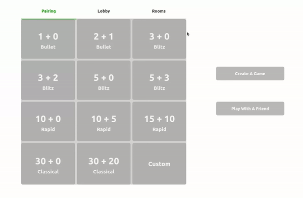
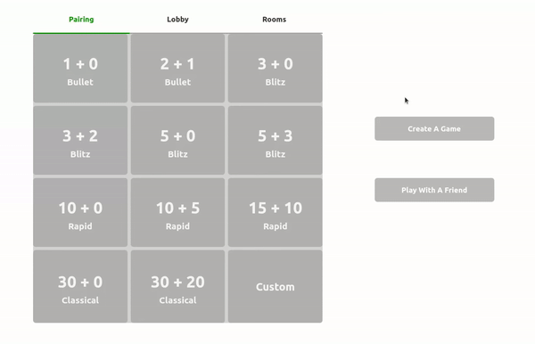
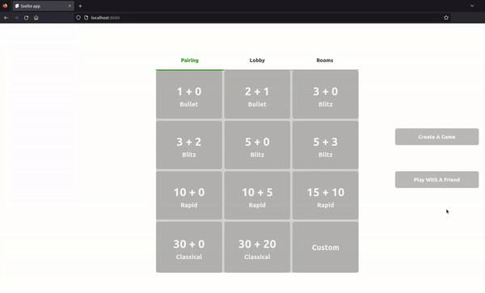
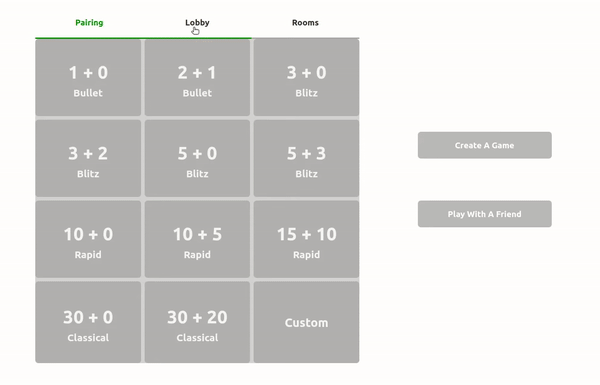
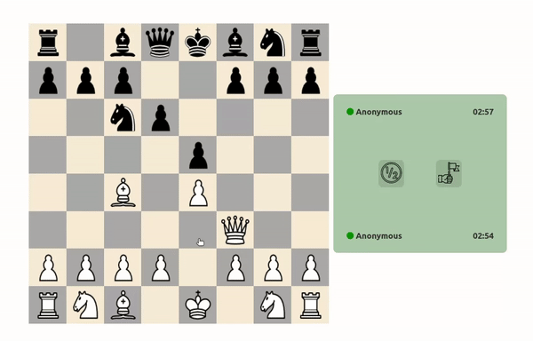
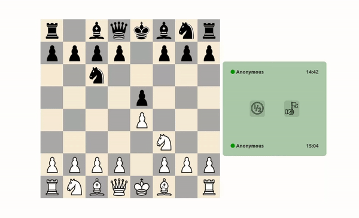

# Chess
A chess application developed using Elixir/Phoenix/OTP (backend) and Svelte (frontend).   
Made by: [diderikk](https://github.com/diderikk)  
Website: TODO

## Content
1. [Introduction](#introduction)
2. [Functionality](#functionality)
2. [Future Work](#future-work)
3. [Deployment](#deployment)
4. [Installation Manual](#installation-manual)

## Introduction
This hobby project was developed during the summer 2022 concurrently with a summer intership (not part of). The main objective was to experiment with [Elixir/OTP](https://elixir-lang.org/getting-started/mix-otp/genserver.html).
As a result I developed a full stack application using Elixir/Phoenix (API framework) and Svelte (JS framework). 
The backend consists of a pure websocket interface (no HTTP endpoints, only WS endpoints) and no database.
All data is stored in memory using Elixir/OTP. 
Elixir/OTP are independent processes with memory that can communicate with the application.    
Svelte was selected as the UI framework because of its reputation of being lightweight, simple, has Typescript support and was a technology that I wanted to experiment with.    
**NB!**  
 Did not bother to add chess functionality backend, because it was complex even in the frontend part using OOP and would probably be harder using functional programming. As a consequence, moves are not being validated by a centralized authority. This can allow users to alter the state or result of the game to their benefit. This was one of the reasons for not implementing a user-rating system.   
Additionally, I have allowed users to connect multiple instances per IP-address to allow for testing. This means it is possible to play against oneself using two browser tabs. 

## Functionality

Responsive

### Lobby
* **Match against oppenents based on time controls.**

* **Create a lobby with a selected time control.**

* **Create a game with a selected time control that creates a link which can be shared with a friend.**

* View all available lobbies that are joinable.
* Join available lobby from lobby list.
* View all games being played.
* **Join a game that is being played as spectator.**

### Chess
* Chess functionality
* Ang passang
* Rochade
* **Checkmate**

### Game
* Abort game before playing a first move.
* Resign
* Suggest remis
* Accept and decline a suggested remis. 
* Click chess piece to show available moves.
* Click available move to move piece.
* **Drag and drop piece.**

* Chess clock - refreshable (a bit inconsistent).

## Future Work
* **Improve the chess clock.** Currently, the backend stores the time of the last played move, which is passed to the frontend on refresh. On the frontend, setTimeout is used to count down the timer, however, it is inconsistent and therefore the frontend won't always correspond with the backend. A solution would be to ping the chess time from the backend every second to the frontend, and thereby removing the storage of last played move time. 

* **Add chess logic in the backend.** In the current implementation, only the frontend has implemented chess logic. As a result, there is no centralized mediator/referee to ensure that no tampering occurs during a game. This is the reason for not implementing a user system with ratings. 

## Deployment

### API
Hosted on a Vultr VM (the same as [ChatApp](https://github.com/diderikk/SimpleChatApp)). The domain is hosted free on Namecheap because of the Github Student Developer Pack. TLS Certificate was retrieved from Let's Encrypt. Docker used for containering of the application. 